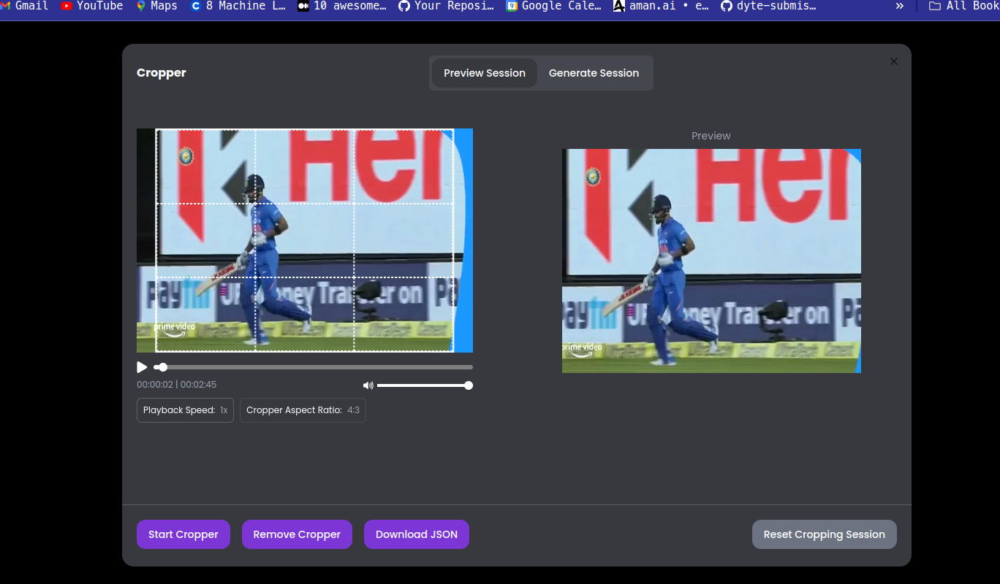
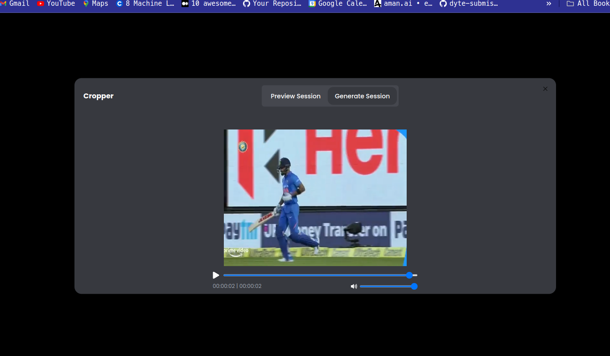

# Video Verse Flip Video Editor Assignment

## How I solved the problem statement

### MAJOR CHECKPOINTS DURING THE ASSIGNMENT

1. Integrating a Video Player
1. Adding a Cropper Tool
1. Playing the Cropped Video in Real-Time
1. Storing and Replaying Session Events

**Integrating a Video Player**

I first tried using react-player, but it didn’t give me enough control. So, I switched to using the default HTML video player and customized it to fit my needs.

**Adding a Cropper Tool**

To add the cropper tool, I used a package called react-rnd. This was easy to work with and I could easily get the coordinates for the cropped part of the video.

**Playing the Cropped Video**

This was a bit tricky. After some research, I found two ways to do it:

1. Use Canvas to show video frames at 24 frames per second (fps).

2. Use another video element and hide the unwanted parts with a parent container.
   I chose the first method because it allows for real-time changes and is better for adding more features, like text, to the video later.

**Storing and Replaying Session Events**
For storing all the actions during a session, I used zustand to manage the state. This part was easy. The hard part was replaying the session because it required listening to various events and updating the preview player accordingly.

### App Snapchots




### ⚙️ Prerequisites

Make sure you have the following installed on your development machine:

- Node.js (version 18 or above)
- npm (package manager)

### 🚀 Getting Started

Follow these steps to get started with the react-vite-ui template:

1. Clone the repository:

   ```bash
   git clone https://github.com/partharora1610
   ```

2. Install the dependencies:

   ```bash
   npm install
   ```

3. Start the development server:

   ```bash
   npm run dev
   ```

### 📜 Available Scripts

- npm run dev - Starts the development server.
- npm build - Builds the production-ready code.
- npm lint - Runs ESLint to analyze and lint the code.

### 📂 Project Structure

The project structure follows a standard React application layout:

```python
react-vite-ui/
  ├── node_modules/      # Project dependencies
  ├── public/            # Public assets
  ├── src/               # Application source code
  │   ├── components/    # React components
  │   │   └── ui/        # shadc/ui components
  │   ├── styles/        # CSS stylesheets
  │   ├── lib/           # Utility functions
  │   ├── App.tsx        # Application entry point
  │   └── index.tsx      # Main rendering file
  ├── .eslintrc.json     # ESLint configuration
  ├── index.html         # HTML entry point
  ├── postcss.config.js  # PostCSS configuration
  ├── tailwind.config.js # Tailwind CSS configuration
  ├── tsconfig.json      # TypeScript configuration
  └── vite.config.ts     # Vite configuration
```
